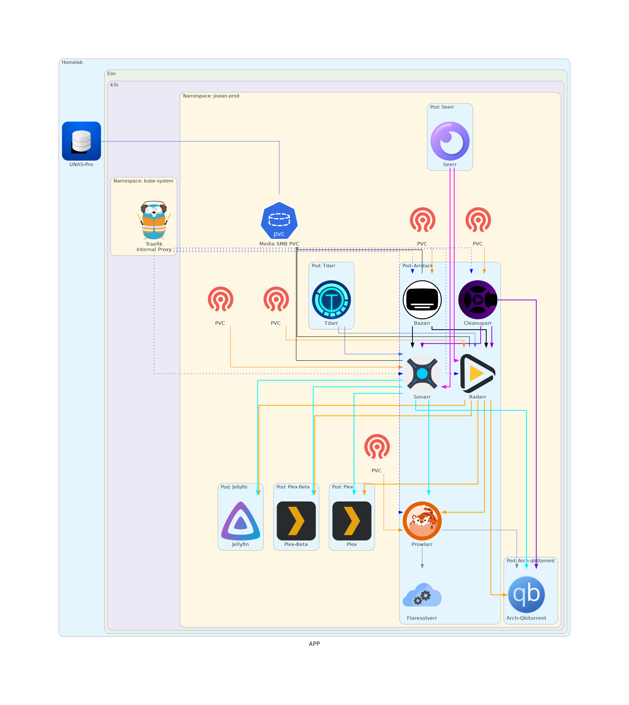

#### Use Case
So many people are familiar with the Arr's and what they can do. At a very high level, they enable automation or media acquisition.

#### Architecture
The Arrstack pod was actually one of the first that was made in this cluster. It actually predates me switching from NFS to SMB based filesharing. As a result, the mount points in the pod say NFS, all while the actual PVC is most definitely backed by an SMB based PV.

Due to each of these apps having their own versions and processes, they each have their own PV's. If backups are enabled, this would allow individual apps to be restored.

Why one big pod? That has a lot to do with this deployment being a bit of a translation from the former docker compose based setup running on the Eos Docker Swarm cluster. Additionally, they're constantly communicating with and in many cases dependent on each other. So it kinda just works.

#### Diagram

#### Sources
[Sonarr](https://github.com/Sonarr/Sonarr)
[Radarr](https://github.com/radarr/radarr)
[Bazarr](https://github.com/morpheus65535/bazarr)
[Cleanuparr](https://github.com/cleanuparr/cleanuparr)
[Prowlarr](https://github.com/prowlarr/prowlarr)
[Flaresolverr](https://github.com/Flaresolverr/Flaresolverr)
