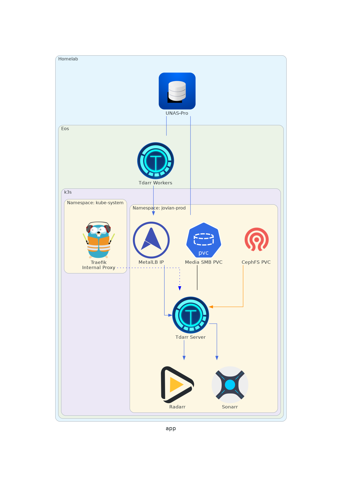

#### Use Case
Tdarr started out as a solution to a few problems. 

1. Plex was having issues properly importing media files. While I created a dashboard to track it, the problem was too frequent to support spot fixes
2. Storage is expensive in 2026
3. Using handbrake with automatic conversion doesn't scale

#### Architecture
Tdarr is set up in two separate layers, the server portion which is managed here via ArgoCD, and the individual LXC containers running the workers that live on the nodes and are managed with Proxmox.

Shared Media storage is handled via the same UNAS-Pro servers that Plex and other media apps pull from.
#### Diagram

#### LXC Config / Setup process
Set up on one, duplicate LXC to other nodes, change config as needed

#### LXC Settings
###### Fstab Entry
```
//IP_HERE/media /media cifs credentials=/etc/.smbcredentials,vers=3.0,iocharset=utf8 0 0
```

###### Service Entry
```
nano /etc/systemd/system/tdarr.service
```

###### tdarr.service file
```
[Unit]
Description=TDarr_Node
After=network.target

[Service]
Type=simple
ExecStart=/root/Tdarr_Node/Tdarr_Node/Tdarr_Node
User=root
Restart=always

[Install]
WantedBy=multi-user.target
```

###### Service Start
```
systemctl daemon-reload && systemctl enable tdarr.service && systemctl start tdarr.service
```

#### Source
https://github.com/haveagitgat/tdarr