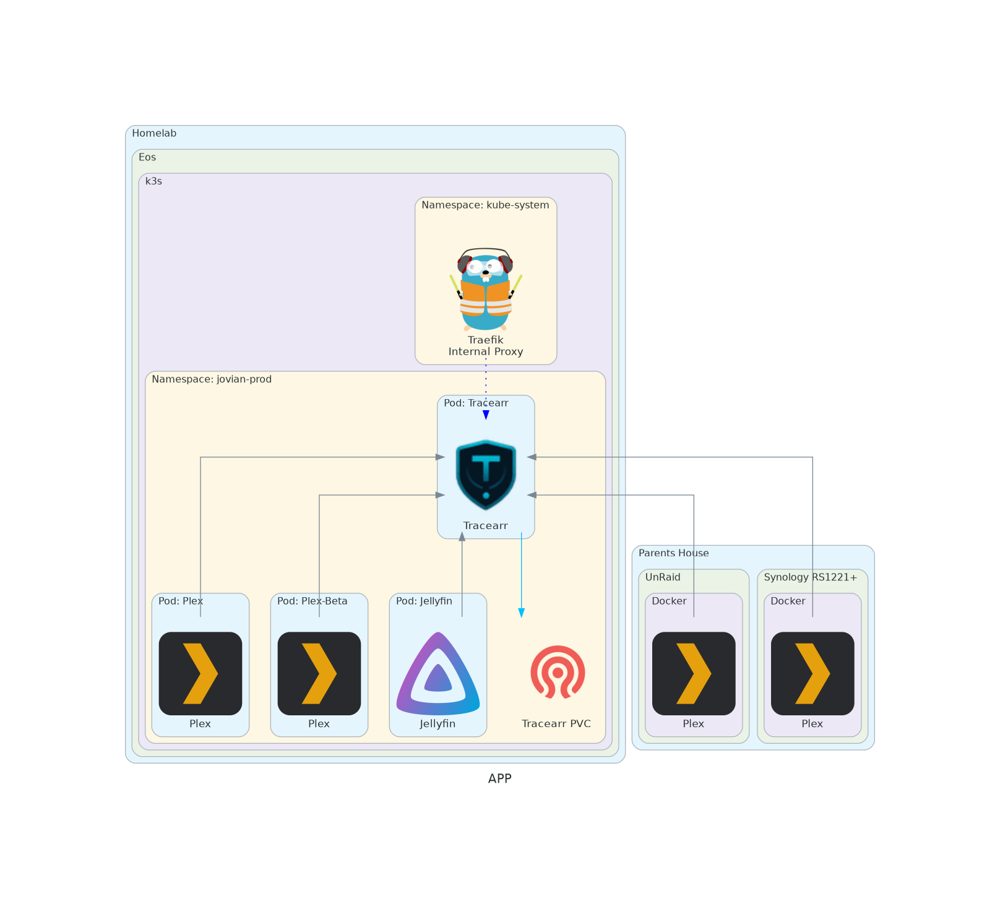

#### Use Case
There are currently 5 media servers I run. Plex, Plex-beta, and Jellyfin run on Jovian. Zen and Andromeda (Both Plex) run at my parents house on the Synology RS1221+ and an UnRaid Server respectively. Zen (The newest) and Andromeda are rarely used by my family.

With so many different servers to keep an eye on, I wanted a single pane of glass. While this is possible with Grafana and various exporters, this time I wanted an out of the box solution.

With tracearr, that problem is solved.
#### Architecture

#### Diagram

#### Source

